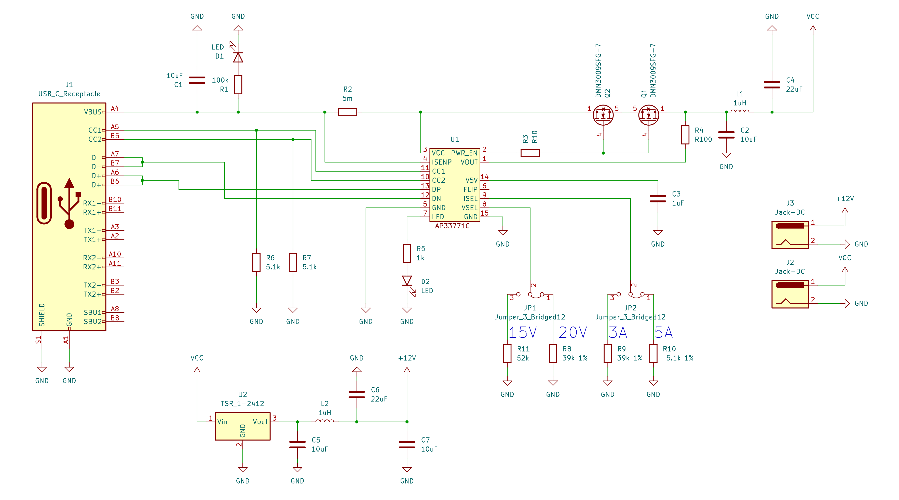
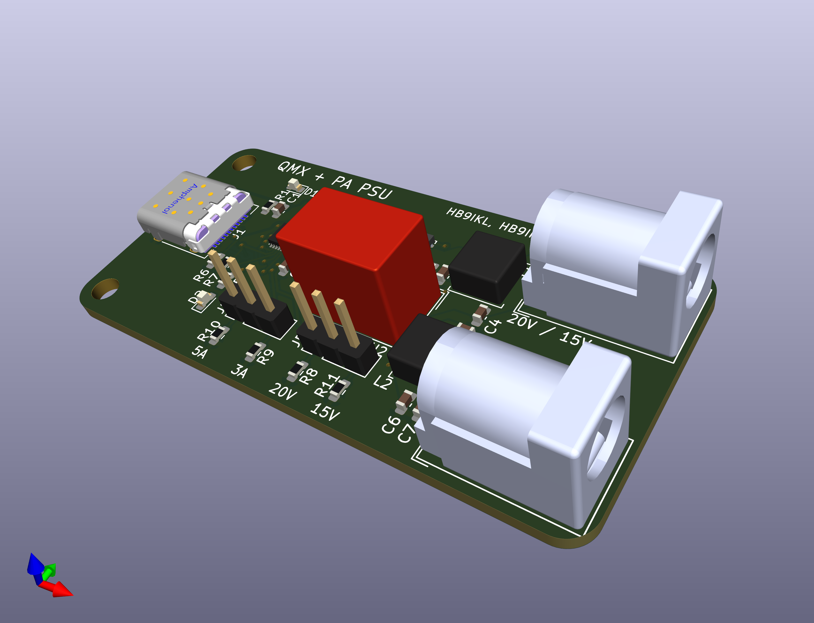

# USB-C PD adapter for QMX + 50W PA

The QMX-PowerplAy is designed to power the [QRP Labs QMX](https://qrp-labs.com/qmx.html) as well as the [50W PA](https://qrp-labs.com/50wpa.html) off a USB PD Powerbank.
Designed for ultimate portability for SOTA / POTA activations, the board can negotiate `15V` or `20V` with `3A` or `5A` for the PA.
A `12V, 5A` switching regulator powers the QMX. Power Negotiation can be selected with simple Jumpers.

## Hardware
### Schematic
The main component is the [AP33771C](https://www.mouser.ch/ProductDetail/Diodes-Incorporated/AP33771CFBZ-13-FA01?qs=2wMNvWM5ZX7JpCFGcPz6nw%3D%3D) which takes care of USB PD negotiations.
Output Voltage and Current can be set through Jumpers `JP1` and `JP2`.
[The Barrel Jack](https://www.mouser.ch/ProductDetail/Wurth-Elektronik/694106301002?qs=a9WhcLg8qCwOEkcI62k5mA%3D%3D) J2 (5.5mm) directly connects to the negotiated power from USB.
J3 (5.5mm) is connected to the stepped-down 12V for supplying the QMX

### Manufacturing
PCBs can be ordered with the gerbers in [fabrication](./powerplay/fabrication).  
The [Component BOM](https://lewerner42.github.io/QMX-PowerplAy/powerplay/bom/ibom.html) [`powerplay/bom/ibom.html`] lists all neccessary components for soldering.
Be aware of Capacitor Voltage ratings (>= 20V) for capacitors connected to USB power.

## Case
The case is entirely 3D printable and files can be accessed in the [Case](./Case) folder.
The `12V` output is labled `QMX` and the USB power (`15V` or `20V`) is labled `PA`.

## Usage
No Substantial Load should be attached to the barrel jacks when powering up.
The QMX and PA can be connected during power-up.
Successfull power negotiation is indicated by LED 2 (`D2`) breathing.
LED 1 (`D1`) indicates if power is present at all.
In case of failiure to negotiate the requested power level either the highest possible negotiated power is present (e.g. `20V`, `3A` even though `100W` werer requested) or only `5V` are present on the PA port.
The step-down (`12V` output) only works if the USB voltage is `> 12V`.
Jumpers `JP1` and `JP2` can be used to change the negotiated power according to the capabilities of the used supply.
The Power select Jumpers are NOT hot-swappable. Change them only when the device is unconnected.
